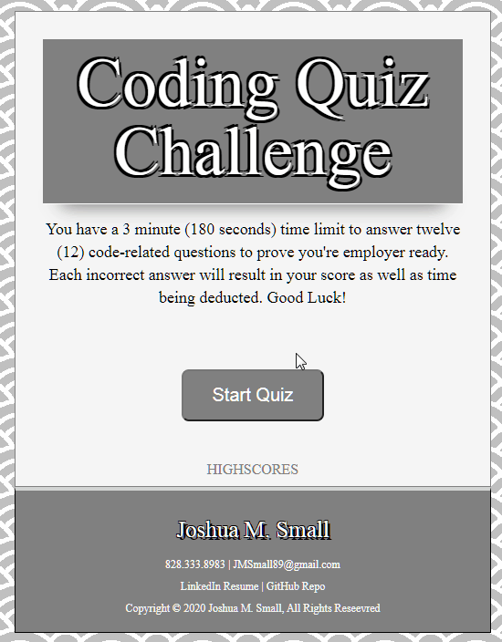

I found this webpage that matched what the assignment called for. I looked over the code and made the changes where I saw fit. Compared to my first entry of this assignment, this code has the proper Web APIs required to power the quiz. One of the stipulations the original web developer requested was that the copyright information be maintained on the quiz, so I placed this information at the bottom of the quiz. Also, the bright colors maybe considered gaudy to some, but it fits my personal aesthetic, and does not showcase my complete ability as an aspiring developer. Anyways, I hope you enjoy the quiz. Good Luck!


# Original Developer's README


# 04 Web APIs: Code Quiz

As you proceed in your career as a web developer, you will probably be asked to complete a coding assessment, which is typically a combination of multiple-choice questions and interactive challenges. Build a timed code quiz with multiple-choice questions. This app will run in the browser and feature dynamically updated HTML and CSS powered by your JavaScript code. It will also feature a clean and polished user interface and be responsive, ensuring that it adapts to multiple screen sizes.

## User Story

```
AS A coding bootcamp student
I WANT to take a timed quiz on JavaScript fundamentals that stores high scores
SO THAT I can gauge my progress compared to my peers
```

## Acceptance Criteria

```
GIVEN I am taking a code quiz
WHEN I click the start button
THEN a timer starts and I am presented with a question
WHEN I answer a question
THEN I am presented with another question
WHEN I answer a question incorrectly
THEN time is subtracted from the clock
WHEN all questions are answered or the timer reaches 0
THEN the game is over
WHEN the game is over
THEN I can save my initials and score
```

The following animation demonstrates the application functionality:


### Review

You are required to submit the following for review:

* The URL of the functional, deployed application.
https://wasteofadrumbum.github.io/Web-APIs-Code-Quiz/

* The URL of the GitHub repository. Give the repository a unique name and include a README describing the project.
https://github.com/WasteOfADrumBum/Web-APIs-Code-Quiz



- - -
© 2019 Trilogy Education Services, a 2U, Inc. brand. All Rights Reserved.
